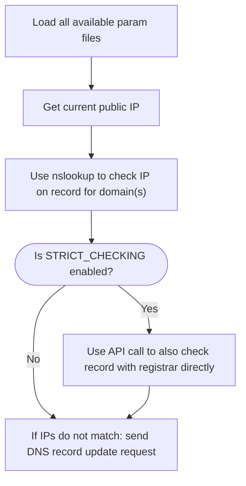
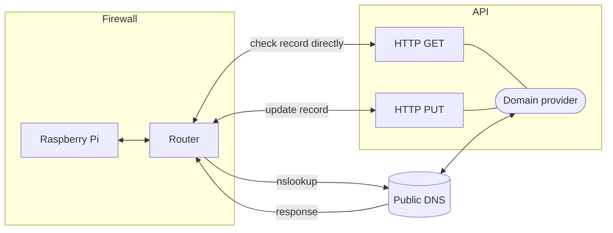
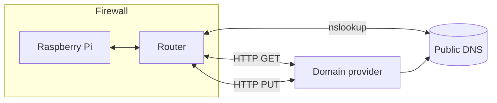

# python-pi-multi-dyndns

A modular Python script for Dynamic DNS, designed to be uploaded to a Raspberry Pi server and work with many different domain registrars.

Currently supported:

- NameSilo.com
- GoDaddy.com
- (Coming soon) aeserver.com

It includes automated setup scripts, and a log cleanup script to keep log file sizes manageable.

----------------------------------------

- [python-pi-multi-dyndns](#python-pi-multi-dyndns)
- [Setup Instructions](#setup-instructions)
  - [Overview:](#overview)
  - [Detailed Instructions:](#detailed-instructions)
- [How to edit](#how-to-edit)
  - [Contributions:](#contributions)
    - [Pull requests](#pull-requests)
  - [How it works](#how-it-works)
    - [Basic program flow of `dyndns.py`:](#basic-program-flow-of-dyndnspy)
    - [URL Calls v1:](#url-calls-v1)
    - [URL Calls v2:](#url-calls-v2)
    - [FAQ](#faq)
    - [To Do:](#to-do)

# Setup Instructions

## Overview:

1. Configure parameter `.py` files
2. Upload `dyndns` folder to Raspberry Pi/server
3. Run `setup.sh` to complete setup

## Detailed Instructions:

1. Download this repo via [the latest .zip file](https://github.com/Kerbalnut/python-pi-multi-dyndns/archive/refs/heads/main.zip) or by [tag](https://github.com/Kerbalnut/python-pi-multi-dyndns/tags)/[release](https://github.com/Kerbalnut/python-pi-multi-dyndns/releases) name, or [clone](https://docs.github.com/en/repositories/creating-and-managing-repositories/cloning-a-repository#cloning-a-repository) it if you have git installed and want to pull updates automatically.
2. Configure appropriate files in the `dyndns/params` folder.
    1. For each domain registrar you want to configure, make a copy of the TEMPLATE file without the `_TEMPLATE` suffix. For example, `GoDaddy_TEMPLATE.py` should become `GoDaddy.py`
    2. Edit each new file with the details specific to your account. This will probably require you to create API keys unique to each domain provider. Site-specific instructions are in the comments of these files themselves.
3. Create the `dyndns` folder on remote server.
    - `mkdir dyndns`
4. Upload the `dyndns` folder to the Raspberry Pi server, using a tool like `scp`.
    - If you're on Windows, open `scp.ps1` in a PowerShell editor like **PowerShell ISE** (built-in to Windows) or **vscode** (Visual Studio Code). Edit the parameters at the very top of the script, and run it.
    - Alternatively the **PuTTY SSH client** comes with the scp tool `pscp.exe` that can be used like this:
        - `cmd.exe \> pscp -r "%UserProfile%\Documents\GitHub\python-pi-multi-dyndns\dyndns\*" pi@192.168.69.42:/home/pi/dyndns/`
        - `powershell.exe \> pscp -r "$env:USERPROFILE\Documents\GitHub\python-pi-multi-dyndns\dyndns\*" pi@192.168.69.42:/home/pi/dyndns/`

5. SSH into the Raspberry Pi server, and navigate to the `dyndns` folder. Add execution permissions to the `setup.sh` file, and run it. (More detailed instructions are within the top comments of the `setup.sh` file itself.) But essentially, these are the only commands that need to be run:
    - `cd ~/dyndns/`
    - `chmod +x setup.sh`
    - `./setup.sh`
6. After `setup.sh` finishes running, it will have already called `dyndns.py` and `logcleanup.sh` to run once as a test, so if it reaches the end with no errors everything should be 100% complete. `setup.sh` will install any missing packages and ask you to restart if necessary, so you may have to run it more than once if that happens.
    - For a live test: Log in to each domain provider's website, and manually change the DNS record to a 'wrong' IP value. Run `python dyndns.py` manually or wait until the scheduled time period for your cron job has passed, and then check the logs. You can either `cat dyndns.log` or download them using the individual commands in the `scp.ps1` script.

# How to edit

To customize & edit these scripts to your liking:

- First [fork](https://docs.github.com/en/get-started/quickstart/fork-a-repo) this repository on github, then [clone](https://docs.github.com/en/get-started/quickstart/fork-a-repo#cloning-your-forked-repository) it to your local machine. 
    - I personally use a combination of tools for working with git: **TortoiseGit**, **GitHub Desktop**, and **vscode**
    - For more info on using git itself: I highly recommend this tutorial by Joel Spolsky (creator of Stack Overflow) that helped me understand it immensely better very quickly: https://hginit.github.io/ (Yes, this is tutorial for Hg/Mercurial and not for git, however these two distributed version control systems (DVCSs) are so similar, there's software that can convert these two different repo types back-and-forth between each other. Many commands are even identical. And the TortoiseHg software comes with a GUI program called Workbench that allows you to easily visualize branching & merging. So ironically the best git tutorial I've found, is this one for hg.)
- **To adopt a similar dev environment,** I used **vscode** (Visual Studio Code) as my main IDE tool to develop this project. All that's required is to open the folder `python-pi-multi-dyndns` in vscode, and it will automatically load the `.vscode` folder within, including settings unique to this project and extension recommendations. This will not affect any of your global preferred vscode settings.
    - **Note about EOL chars:** All files in this repo are being forced to use LF. In my environment, I'm using a Raspberry Pi as my DNS server, and uploading these scripts to it from a Windows machine. Now, git by default has an option turned on called `AutoCrLf` that will automatically change the EOL char of your files to match whatever OS you're using. E.g. I'm using Windows, so every file automatically gets loaded from git as CRLF, no matter how they were orginally commited. But when you upload these scripts to raspbian it will barf on the EOL characters not being LF, and all the IDEs/editors I'm using on Windows don't care which is. So, **.gitattributes** has been updated to force all files to load with LF. This might possibly affect other Windows files, like `scp.ps1` or `scp.bat`, so keep that in mind. (Just change them back to CRLF in editor of your choice if you get errors.)
- **To add functionality with other domain registrars/providers,** open `dyndns.py` in an editor such as vscode, copy one of the DynDNS python functions, and start editing it to match the API calls for their system.
    - Use the logging functions provided within the `dyndns.py` script to keep all log tags standardized. 
    - In the `params` folder, copy one one of the `*_TEMPLATE.py` files with a name that matches the new domain provider. Update it with demo/sample values that match their format of their API keys.
        - **Make sure** after creating the actual params `*.py` file and populating with your real API keys, you add it to `.gitignore` instead of accidentially committing it to the repo! (Even if you do, just generate new API keys and invalidate the old ones.)
    - Don't forget to include a `import params.ExampleSite as paramsExampleSite` line at the top, and update the main script logic at the bottom of `dyndns.py` to use the new function.
- **To update the logging functionality:** open `dyndns.py` in an editor such as vscode. All logging functions start with a **LogFile** -prefix. Start with reading the help text at the top of the **LogFileInit()** function, it is the master guiding script that controls & cleans-up everything. The official help text for using these functions is in the comments at the top of each as well, and all instructions for using them should be updated there.

## Contributions:

All contributions are welcome!

To let me know about any problems you run into, feel free to open a [GitHub Issue](https://github.com/Kerbalnut/python-pi-multi-dyndns/issues).

### Pull requests

I don't get a lot of pull requests and don't check my github account religiously for them, so it may take some weeks or longer for a response. But do not worry, it is not being ignored!

1. Create a new [fork](https://docs.github.com/en/get-started/quickstart/contributing-to-projects#forking-a-repository) of this repo on your account.
2. Commit some changes to the new fork.
3. Create a [Pull Request](https://docs.github.com/en/get-started/quickstart/contributing-to-projects#making-a-pull-request) for your commits be pulled into this repo.

(In the `.vscode` folder, there's also extension recommendations like for "Markdown All in One" that are only for auto-updating the Table of Contents of the Readme file. If you're not updating `README.md`, it's not really necessary.)

## How it works

### Basic program flow of `dyndns.py`:

<!-- https://docs.github.com/en/get-started/writing-on-github/working-with-advanced-formatting/creating-diagrams -->
<!-- https://mermaid.js.org/syntax/flowchart.html#graph -->

Description of `dyndns.py` program logic:

1. First we must **get our current public IP address,** via builtin Python libraries, or a function to make an API call to a 3rd party site. Which methods of public IP tests and how many are done can be configured by editing the main script logic at the bottom.
2. Check in the `params` folder for any `.py` files that don't include the text `_TEMPLATE`, and import them so their vars can be used later in the script.
    - Currently this part is experimental because I'm still not entirely sure how "compiling" and "importing modules" works in Python. But I've noticed these `.py` scripts get auto-compiled into `.pyc` scripts when you run `import` on them. This can be taken advantage of, we can then delete the `.py` scripts after they're compiled to wipe out the plaintext copies of sensitive data on the server.
    - NOTE that this isn't exactly "good security", because `.pyc` files can still be decompiled with available tools. But still, better than plaintext, right?
    - The only issue I can see with this practice is it assumes you'll be uploading these files to a server, so that it'll always safe to delete the plaintext files immediately on first run. This could be fixed by restructuring the less sensistive params into a separate file, and still is not a huge deal as new API keys are easy to generate.
3. For each domain name that was loaded in the parameters, use a basic `nslookup` command to look-up it's current IP on record.
4. Optionally if `STRICT_CHECKING` is set, also send an API call to the domain provider itself anyways to double-check directly with them what IP is on record.
5. Compare current public IP with the set DNS records. If any value does not match, send an API call to the domain provider to update the DNS record.

A series of custom logging functions are included with the Python script specifically for Dynamic DNS logging, to keep the log file simple & readable, DynDNS-specific, and minimize writes to the Rasberry Pi's SD card. This also allows the same log tags to be used across multiple domain providers and keep thge same formatting.

Logic for the API calls to the domain registrars is also functionalized, so modifying this script to add compatibility with more domain providers is basically as simple as copying one of these functions, and modifying it to the specifics for that API system.

### URL Calls v1:

### URL Calls v2:

### FAQ

- **If this is a python project, why is there so much shell code?** - Most of the excess shell code you see in the breakdown comes from a mini-game script called `rand.sh` in the `lib` folder. This mini-game is just that - a completely unnecessary game that only gives you one final ouput: a randomly-picked integer between 0-59. Literally a one-liner could replace it. But this is a game, so it includes graphics and a hidden progression system. I have very little experience with shell code, so I have been using this project as a way to practice and get better at it, and when I discovered the RANDOM variable I realized it was powerful enough to make simple games with. So, rand.sh became a side project within this project that allowed me to explore different ways to play with randomness. If you want to avoid it, you'll know which options to pick when you're running `setup.sh`. The setup script should even technically still run fine if you just delete `rand.sh` completely (but I haven't tested this yet!).

### To Do:

- [ ] NameSilo functions are still a complete mess after being adapted from static script into new function based format. They still have lots of junk and test code, but also have a weird layout.
- [X] Load params modularly.
- [ ] Add aeserver.com compatibility.
- [ ] Test clean install & instructions.
- [ ] Add GoDaddy JSON capability for testing and practice.
- [ ] Standardize param files var names.
- [ ] Update and test `logcleanup.sh` to clean up _CURATED and stop using static paths
- [ ] Test with python3
- [ ] Test with python2.7 and python3
- [ ] Remove `scp.bat` or update it so that it works
- [X] Add logging functionality to setup script.
- [ ] Test if `setup.sh` still works without `colors.sh`
- [ ] Test if `setup.sh` still works without `rand.sh`
- [ ] Test running `setup.sh` with/without sudo
- [ ] ~~Make `setup.sh` prompt user to confirm username before running.~~
- [X] Remove `setup.sh` references to hard-coded username 'pi', replace with `$USER` var.

